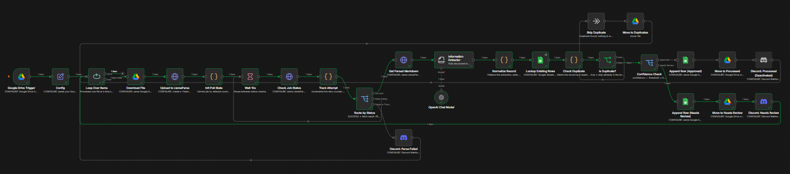

# Document Data Extractor

Drop a document into a Google Drive folder. About a minute later, its details appear as a checked row in a Google Sheet.

## What it does
1. Watches an **Invoice Inbox** folder in Google Drive.
2. Reads the file with LlamaParse.
3. Extracts fields (vendor, invoice number, dates, tax, total, line items) with an OpenAI model.
4. Checks the result before saving:
   - **Maths:** subtotal + tax must equal the total.
   - **Duplicates:** the same vendor and invoice number is skipped.
   - **Confidence:** below 0.8 goes to review.
5. Writes a row to the Sheet, moves the file to **Processed**, **Needs Review** or **Duplicates**, and sends a Discord alert when something needs attention.

## Setup
1. **Google Sheet** with a tab named `Invoices` and these headers in row 1:
   `timestamp, review_status, source_file, file_link, document_type, vendor_name, invoice_number, invoice_date, due_date, currency, subtotal, tax, total_amount, line_item_count, line_items, confidence_score, totals_check, dedup_key, file_id`
2. **Four Drive folders:** Invoice Inbox, Invoice Processed, Invoice Needs Review, Invoice Duplicates.
3. **Credentials in n8n:** Google (Drive and Sheets), LlamaParse (Header Auth `Bearer <key>`), OpenAI, Discord webhook.
4. Import `workflow.json`, then pick your folders, Sheet and credentials in each node. Set `sheet_url` in the **Config** node.
5. Publish.

## Test it
- `sample-invoice-clean.pdf` goes to Processed and adds a row.
- `sample-invoice-review.pdf` has a wrong total, so it goes to Needs Review.
- Drop the clean one in again: it is skipped as a duplicate.

## Other document types
Edit the fields in the **Information Extractor** node to extract whatever you need.

*The sample invoices are fictional.*
